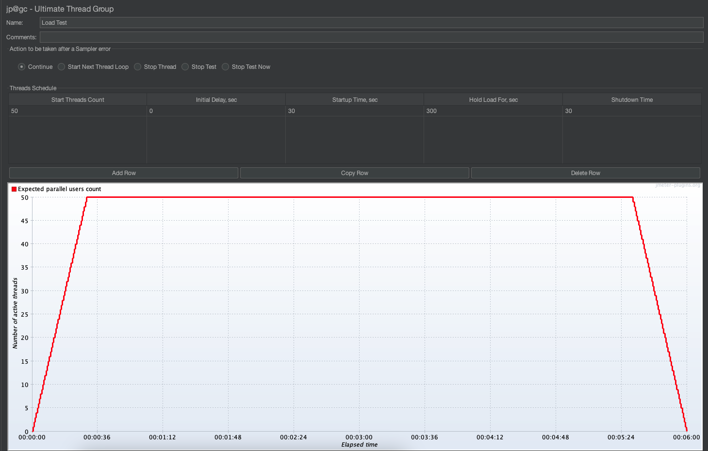
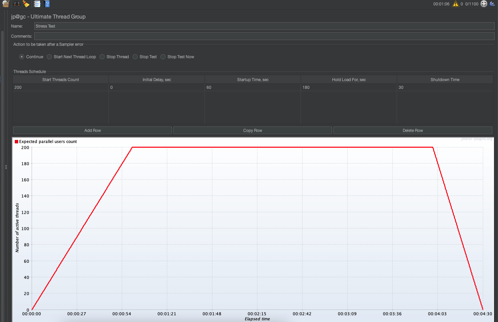
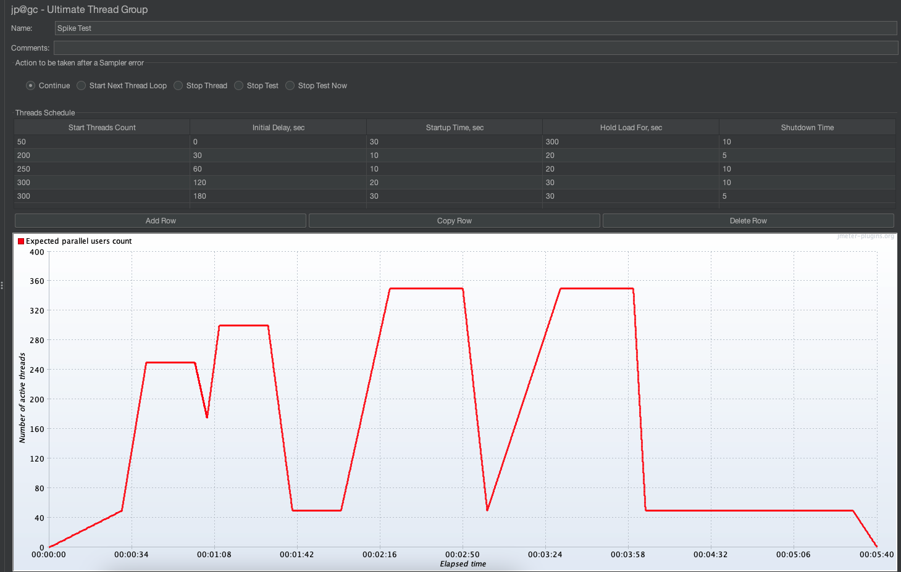
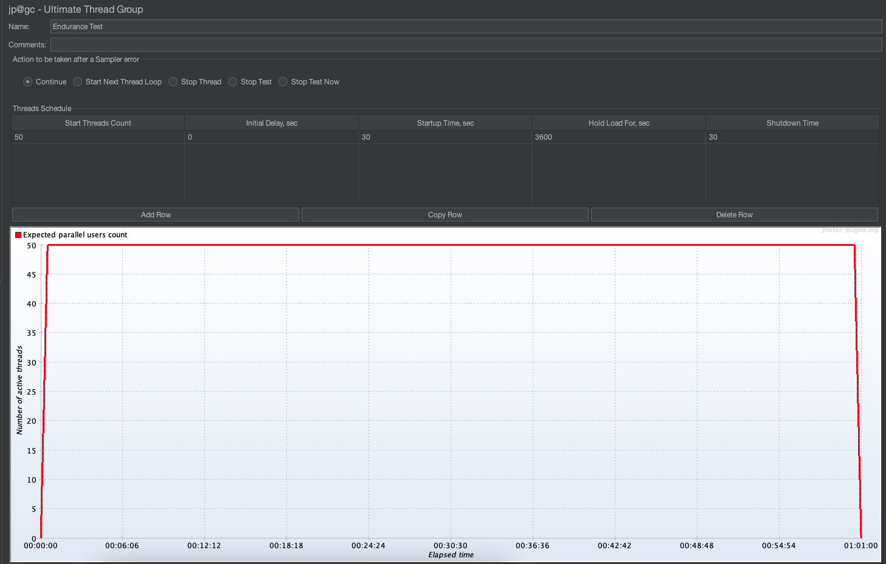

# HTTPBin Performance Test — Complete Solution

This repo contains a performance testing framework for the HTTPBin API (local Docker instance), including JMeter test plans, scripts for running Load/Stress/Spike/Soak scenarios, reporting, and a GitHub Actions pipeline for running smoke performance tests on every push.

## Contents
- `jmeter/`
  - `httpbin_test_plan.jmx` — main JMeter test plan with parameterization and assertions
  - `users.csv` — (optional) user data or variable CSV for parameterization
  - `env.properties` — environment-specific values (base URL, thread counts, durations)
  - `run_jmeter.sh` — helper script to run JMeter in non-GUI mode and generate HTML report
- `.github/workflows/`
  - `performance-smoke.yml` — GitHub Actions pipeline to run a smoke performance test and upload report
- `docker/`
  - `docker-compose.yml` — starts httpbin locally via official image for testing
- `reports/` — generated JMeter HTML reports (gitignored)
- `README.md` — this file

---

## Quick start (local)

### Prerequisites
- Java 8+ (for JMeter)
- Apache JMeter (recommended 5.5+)
- Docker & docker-compose
- Git
- (Optional) curl, unzip

### 1) Start the HTTPBin API locally
We use the official httpbin Docker image.

```bash
# from repo root
cd docker
docker-compose up -d
# confirm it's up:
curl http://localhost:8000/get
```

## Command to the run the test
```bash
chmod +x jmeter/run_jmeter.sh
./jmeter/run_jmeter.sh
# Open the generated HTML report in reports/<timestamp>/report/index.html
```


### Test scenarios included
The JMeter test plan (jmeter/httpbin_test_plan.jmx) contains separate Thread Groups (or uses a single Thread Group with Test Fragments) to implement:

**Load Test** — sustained traffic at expected levels (e.g., 50 / 100 / 500 users, configurable). Duration configurable via ${__P(duration,300)}.

**Stress Test** — ramp users up past expected capacity to find breaking point. Use step-up ramp or increase threads to high values.

**Spike Test** — abrupt jump in virtual users (e.g., 10 → 500 instantly) to validate system reaction.

**Endurance Test** — long-duration, moderate load (e.g., 2–6 hours) to detect memory leaks, resource exhaustion.


### Critical endpoints covered:
* GET /get
* POST /post
* PUT /put
* DELETE /delete

Each sampler includes response assertions (HTTP 200/201, JSON content checks) and JMeter response time assertions (e.g., 95% of requests < 2000 ms) as well as listeners for throughput, response times, and error counts.


### Metrics captured & thresholds (SLA)
#### Captured metrics:

* Response time: min, max, mean, 90th/95th percentiles

* Throughput: requests/sec

* Error rate: % failed requests

* JMeter aggregate metrics: median, standard deviation

* System resource metrics (optional): CPU, memory, network — via docker stats

#### Example SLA thresholds:
* Avg response time < 2000 ms

* 95th percentile < 3000 ms

* Error rate < 1%

* Throughput (target): depends on scenario; measure baseline

If SLA/threshold assertions fail the test, the JMeter plan will mark assertions as failed and the JTL will indicate failures.


### Reporting
We use JMeter's built-in HTML report generation (via -e -o <output>). The HTML report contains:
* Dashboard graphs (response times over time, percentiles, throughput)
* Error table, request summary
* Request slowest samples

-----------------
### Load Test
Goal: Validate performance under expected daily load.

Objective: Check stability, throughput, response time SLAs.

Assertions / SLAs:
* Response time (avg) < 1s



-----------------
### Stress Test
Goal: Identify system breaking point.

Objective: Push system gradually beyond normal capacity.

Assertions / SLAs:
* Response time (avg) < 1s



-----------------

### Spike Test
Goal: Test system resilience to sudden traffic bursts.

Objective: Ensure app recovers after an instantaneous surge.

Assertions / SLAs:
* Response time (avg) < 1s

#### Expected Behavior:

* Initial response latency spike, then recovery.
* No persistent errors after spike ends.



-----------------
### Endurance Test
Goal: Detect memory leaks, stability, or resource exhaustion over time.

Objective: Run long and steady under nominal load. Look out for OOM. 

Assertions / SLAs:
* Response time (avg) < 1s




### What CICD github workflow does
1. Installs Java and JMeter.
2. Runs httpbin Docker container.
3. Runs a small smoke test (10 users, 30 seconds).
4. Generates an HTML report and uploads it as an artifact.

For long-term or CI-driven reporting, we can push results into a time-series store (InfluxDB) and visualize via Grafana (optional, advanced).

### How to parameterize & reuse the framework
* Use ${__P(myprop,default)} in JMeter to accept properties from CLI (-J).
* Store environment-specific configs in jmeter/env.properties (QA/Stage/Prod).
* Use CSV Data Set Config for payload variation (users.csv).

### CI tips and failure gating
In CI, run a small smoke test on each PR to catch regressions.

For gating: fail the job if global error percentage > 1% or if 95th percentile > configured SLA.

Achieve this by adding an additional step to parse results.jtl (e.g., using jtl-utils or a simple Python script) and exit 1 if thresholds exceeded.


### Improvements & next steps
* Integrate InfluxDB + Grafana for long-term metric retention and dashboards.
* Add system resource collection (Prometheus node exporter) when testing real services.
* Add artifacts for test CSVs and sample payloads in testdata/.
* Add more complex JMeter test fragments for chained flows (login → purchase → fetch).


